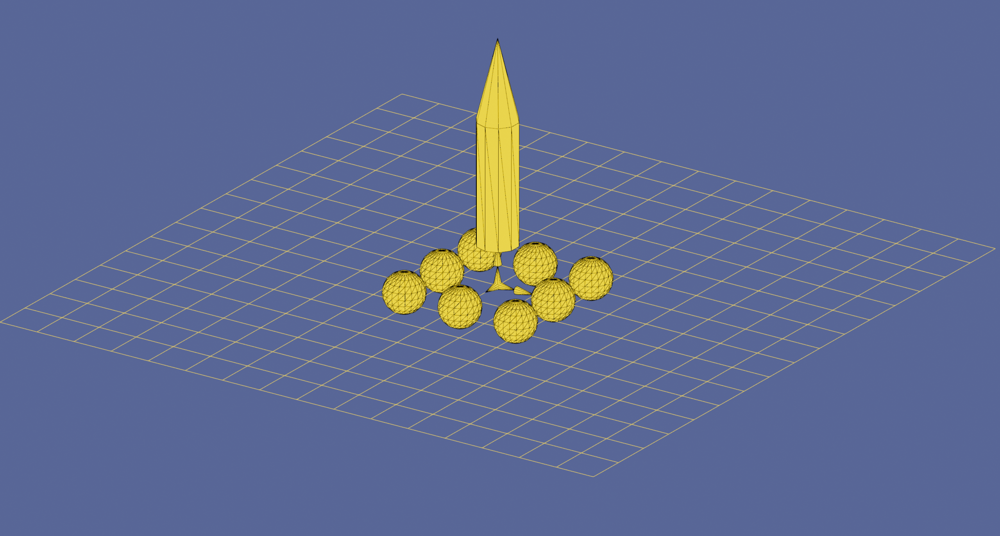

## FilApp

Dabbeling with OOP in a 3d graphics app.



## Building

Download the source code:

```
git clone https://github.com/timow-gh/FilApp.git
```

### Windows

Tested with Visual Studio 16, 64bit. Configure cmake:

```
cmake -B "path-to-build-dir" -S "path-to-source-dir" -G "Visual Studio 16 2019" -A x64 -DBUILD_SHARED_LIBS=OFF -DCMAKE_BUILD_TYPE=Release -DCXX_STANDARD=C++20
```

Build the target FlowMeshApp:

```
cmake --build "path-to-build-dir" --target FlowMeshApp --config Release --parallel
```