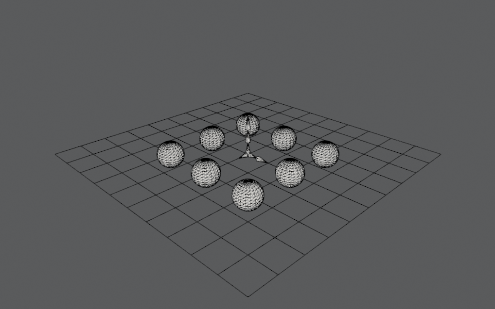

## meshler

[](https://github.com/timow-gh/meshler/actions/workflows/ubuntu.yml)
[](https://github.com/timow-gh/meshler/actions/workflows/windows.yml)

This is a test project to experiment with CMake, MVC and OOP for Clean Architecture.

* See how to build a project that has dependencies with CMake (FetchContent, ExternalProject)
    * Refactored third party libs (google filament, crossguid) to use FetchContent
    * How to reuse a library (core) in multiple projects
* See how a core project with common types could be used
    * This would allow to change out types application wide and measure the change application wide
* Test some OOP design patterns and clean architecture
    * Testing how to use the MVC design pattern while having a clean architecture



## Building

### Windows

Tested with Visual Studio 16, 64bit. Configure cmake:

```
cmake -B <path-to-build-dir> -S <path-to-source-dir> -G "Visual Studio 16 2019" -A x64 -DBUILD_SHARED_LIBS=OFF -DCMAKE_BUILD_TYPE=Release -DCMAKE_CXX_STANDARD=20
```

Build the target MeshlerApp:

```
cmake --build <path-to-build-dir> --target MeshlerApp --config Release --parallel -- /p:CL_MPcount=<your-number-of-processors>
```

### Ubuntu

Requirements:

- libglu1-mesa-dev # listed filament dep
- libxi-dev # listed filament dep
- libxxf86vm-dev # for sdl2

```
sudo apt install libglu1-mesa-dev libxi-dev libxxf86vm-dev
```